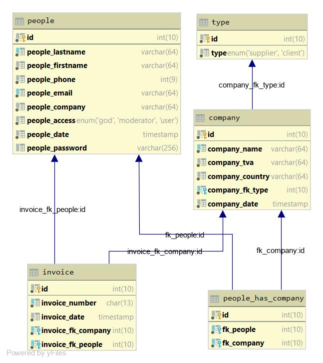

# Accounting application of the COGIP
A team project with MVC about PHP

## Table of contents
* [Team](#Team)
* [Project](#Project)
* [Duration](#Duration)
* [Mock-up](#Mock-up)
  * [Database](#Database)
  * [App](#App)
* [Technology](#Technology)
  * [Front-End](#Front-End)
  * [Back-End](#Back-End)
* [Sources](#Sources)

## Team

- [Julio ZINGA] (https://github.com/julio-34727)
- [Matis Karamenderes] (https://github.com/MKaramen)
- [Yong Chin Zhuang] (https://github.com/yongchin95)

## Project
You can acces the project [here] (https://github.com/MKaramen/COGIP-app)

We will evaluate our project based on:

* Use of correct joins in SQL and use of aliases in your SQL request
* use of sanitization to avoid SQL injections
* Implementation of a CRUD
* Use an MVC structure
* Use a router
* allow access to certain page in regards to permissions
* And more ...

You can see the instructions [here] (https://github.com/becodeorg/BXL-Johnson-4.14/tree/master/06-PHP/cogip)

## Duration
We had 10 days to work on this project from 25/10/2019 to 08/11/2019.

## Mock-up

### Database
To be completed...

  

### App
To be completed...

## Technology

### Front-End

* HTML5
* CSS3
* JavaScript

### Back-End

* PHP

## Source 
To be completed...
